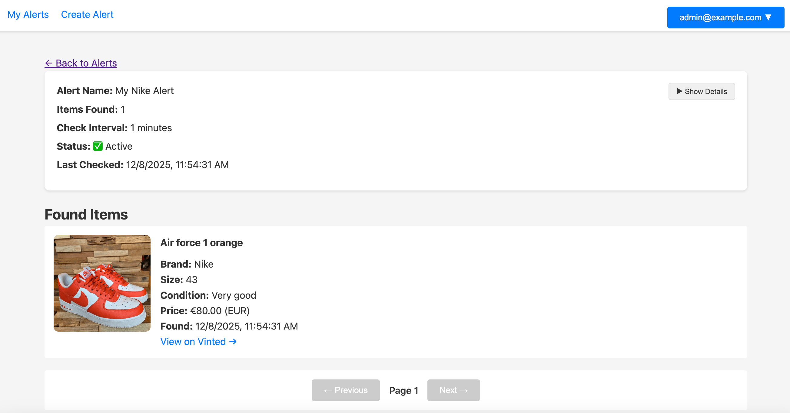

# VintScout

Vinted does not support notifications. This is a self-hosted web application for monitoring Vinted marketplaces. Create custom alerts and receive notifications when new items matching your criteria are listed.



## Features

- **Smart Search**: Autocomplete brand search and visual category tree navigation
- **Multi-Country Support**: Monitor Vinted marketplaces across 20+ European countries
- **Telegram Notifications**: Instant alerts when new items match your criteria
- **Self-Hosted**: Complete control of your data 
- **Docker Ready**: One-command deployment with Docker Compose

## TODO
- **Improved Search**: Add filter by size, color, condition, etc.
- **Email Notifications**: Alternative to Telegram alerts
- **Improved UI**: More user-friendly interface and mobile responsiveness
- **Cloud Deployment**: Managed hosting option with PostgreSQL backend

## CI/CD
- GitHub Actions workflow `.github/workflows/dockerhub-publish.yml` builds the Docker image on every push to `main` and pushes it to Docker Hub.
- Set the following repository secrets before enabling the workflow:
  - `DOCKERHUB_USERNAME`
  - `DOCKERHUB_TOKEN` (create a Docker Hub access token)
- Images are tagged as `latest` and with the commit SHA (e.g., `vincentgaul/vintscout:abc1234`).

## Quick Start

**Prerequisites**: Docker and Docker Compose

1. Clone the repository:
   ```bash
   git clone https://github.com/yourusername/vintscout.git
   cd vintscout
   ```

2. Start the application:
   ```bash
   docker-compose up -d
   ```

3. Access the web interface at `http://localhost:3000`
   - Default credentials: `admin@example.com` / `admin`

The application includes a pre-seeded database with popular brands and categories. Your data persists in a Docker volume.


### Unraid / Docker CLI

For Unraid or other Docker-based systems you can either run the single `docker run` command below **or** use Docker Compose.

#### Option A: docker-compose.yml

Create a `docker-compose.yml` like this (adjust paths/secrets):

```yaml
version: "3.9"

services:
  vintscout:
    image: vincentgaul/vintscout:latest
    container_name: vintscout
    restart: unless-stopped
    ports:
      - "3000:3000"
    volumes:
      - /mnt/user/appdata/vintscout:/app/backend/data
    environment:
      DEPLOYMENT_MODE: self-hosted
      DATABASE_URL: sqlite:////app/backend/data/vinted.db
      JWT_SECRET: your-secret-here
      TELEGRAM_BOT_TOKEN: ""
      TELEGRAM_CHAT_ID: ""
```

Then run `docker compose up -d` (or use Unraid's Compose Manager plugin).

#### Option B: Docker CLI

If you prefer raw Docker commands, first build or pull the image, then run:

```bash
# Option 1: Pull from Docker Hub
docker pull vincentgaul/vintscout:latest

# Option 2: Build locally
git clone https://github.com/vincentgaul/vintscout.git
cd vintscout
docker build -t vintscout:latest .
```

Then run the container:

```bash
docker run -d \
  --name=vintscout \
  -p 3000:3000 \
  -v /mnt/user/appdata/vintscout:/app/backend/data \
  -e DEPLOYMENT_MODE=self-hosted \
  -e DATABASE_URL=sqlite:////app/backend/data/vinted.db \
  -e TELEGRAM_BOT_TOKEN=your-bot-token \
  -e TELEGRAM_CHAT_ID=your-chat-id \
  -e JWT_SECRET=your-secret-here \
  --restart unless-stopped \
  vintscout:latest
```

**Unraid Web UI Configuration:**
- **Repository:** `vincentgaul/vintscout:latest`
- **Port:** `3000` (container) → `3000` (host)
- **Path:** `/app/backend/data` (container) → `/mnt/user/appdata/vintscout` (host)
- **Environment Variables:**
  - `DEPLOYMENT_MODE=self-hosted`
  - `DATABASE_URL=sqlite:////app/backend/data/vinted.db`
  - `TELEGRAM_BOT_TOKEN=` (your bot token)
  - `TELEGRAM_CHAT_ID=` (your chat ID)
  - `JWT_SECRET=` (generate with `openssl rand -hex 32`)

Your database file will be accessible at `/mnt/user/appdata/vintscout/vinted.db` on your Unraid server.

## Configuration

Environment variables can be configured via `.env` file. Copy `.env.example` to get started:

```bash
cp .env.example .env
```

**Key settings:**
- `TELEGRAM_BOT_TOKEN` / `TELEGRAM_CHAT_ID`: Telegram notifications (optional)
- `JWT_SECRET`: Generate with `openssl rand -hex 32` (recommended for production)
- `DATABASE_URL`: Defaults to SQLite, can use PostgreSQL for cloud deployments

See `.env.example` for all available options.


## Supported Countries

France, Ireland, Germany, United Kingdom, Spain, Italy, Poland, Czech Republic, Lithuania, Latvia, Netherlands, Belgium, Austria, Luxembourg, Portugal, Sweden, Denmark, Finland, Hungary, Romania

## License

MIT License - see [LICENSE](LICENSE) file for details

## Acknowledgments

Inspired by [VintedScanner](https://github.com/drego85/VintedScanner) by Andrea Draghetti. This is a complete rewrite with a web-based architecture.

## Legal Notice

This tool accesses public data from Vinted websites. Use responsibly and in accordance with Vinted's Terms of Service.
